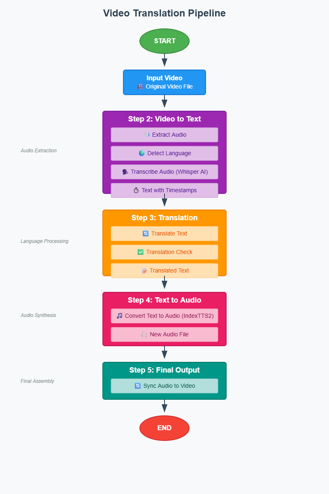

# AutoTranscriber 🎬🎙️

<div align="center">



**AI-Powered Video Subtitle Generation, Translation & Voice Cloning System**

[](https://nextjs.org/)
[](https://reactjs.org/)
[](https://www.typescriptlang.org/)
[](https://www.python.org/)
[](https://github.com/openai/whisper)
[](LICENSE)

[Features](#-features) • [Demo](#-demo) • [Installation](#-installation) • [Usage](#-usage) • [Tech Stack](#-tech-stack) • [Contributing](#-contributing)

</div>

---

## 📋 Table of Contents

- [Overview](#-overview)
- [Features](#-features)
- [Demo](#-demo)
- [Tech Stack](#-tech-stack)
- [Architecture](#-architecture)
- [Installation](#-installation)
- [Usage](#-usage)
- [API Endpoints](#-api-endpoints)
- [Configuration](#-configuration)
- [Troubleshooting](#-troubleshooting)
- [Contributing](#-contributing)
- [License](#-license)
- [Acknowledgments](#-acknowledgments)

---

## 🌟 Overview

**AutoTranscriber** is a comprehensive AI-powered video processing platform that combines cutting-edge speech recognition, neural machine translation, and voice cloning technologies to provide:

- 🎯 **Automatic subtitle generation** from video/audio files
- 🌍 **Multi-language translation** (100+ languages supported)
- 🔥 **Subtitle burning** directly onto videos
- 🎙️ **Voice cloning with emotion detection** using IndexTTS2
- 🎨 **Modern, intuitive web interface** built with Next.js

Perfect for content creators, video editors, accessibility teams, and language learners!

---

## ✨ Features

### Core Capabilities

#### 🎬 **Video Processing**
- Upload videos in any format (MP4, AVI, MOV, MKV, etc.)
- Automatic audio extraction using FFmpeg
- Real-time processing status updates
- Video preview with playback controls

#### 🎯 **Subtitle Generation**
- Powered by **OpenAI Whisper** (small model)
- Automatic language detection (90+ languages)
- High accuracy transcription
- Outputs in SRT and VTT formats
- Timestamp synchronization

#### 🌍 **Translation**
- **Facebook M2M100** neural translation model
- Support for 100+ language pairs
- Context-aware translations
- Preserves subtitle timing and formatting
- Major languages supported:
  - English ↔ Spanish, French, German, Italian
  - English ↔ Japanese, Chinese, Korean
  - English ↔ Arabic, Hindi, Russian
  - And 90+ more!

#### 🔥 **Subtitle Burning**
- Embed subtitles directly into video
- FFmpeg-powered overlay rendering
- Customizable subtitle styling
- Multiple format support
- No quality loss

#### 🎙️ **Voice Cloning (IndexTTS2)**
- High-quality text-to-speech with voice cloning
- Emotion detection and preservation
  - Angry, Sad, Happy, Calm emotions
- Clone voice from 5-second samples
- Natural prosody and intonation
- Multi-language TTS support
- Real-time factor (RTF) optimization

### User Experience

- 📱 **Responsive Design** - Works on desktop, tablet, and mobile
- ⚡ **Real-time Progress** - Live updates for all operations
- 📥 **Easy Downloads** - One-click download for all generated files
- 🎨 **Modern UI** - Built with shadcn/ui components
- 🔄 **Batch Processing** - Process multiple videos sequentially

---

## 🎥 Demo

### Main Interface


**Upload & Processing:**
1. Drag & drop or click to upload video
2. Auto-extracted audio displayed
3. Real-time progress bars for each step

### Subtitle Generation


**Features:**
- Automatic language detection
- Real-time transcription progress
- Preview generated subtitles
- Download SRT/VTT files

### Translation Panel


**Multi-language Support:**
- Select target language from 100+ options
- Side-by-side comparison
- Instant translation preview
- Download translated subtitles

### Video Output


**Final Output:**
- Video player with burned subtitles
- Download final video
- Audio output with voice cloning
- Complete workflow in one place

---

## 🛠️ Tech Stack

### Frontend

| Technology | Version | Purpose |
|-----------|---------|---------|
| **Next.js** | 14.2.5 | React framework with App Router |
| **React** | 18 | UI component library |
| **TypeScript** | 5 | Type-safe JavaScript |
| **Tailwind CSS** | 3.4.1 | Utility-first CSS framework |
| **shadcn/ui** | Latest | Modern UI components |
| **Lucide React** | Latest | Beautiful icon library |

### Backend (Python)

| Technology | Version | Purpose |
|-----------|---------|---------|
| **OpenAI Whisper** | v20250625 | Speech recognition & transcription |
| **Facebook M2M100** | Latest | Neural machine translation |
| **Transformers** | 4.44.2 | Hugging Face model library |
| **PyTorch** | 2.1.0+cpu | Deep learning framework |
| **FFmpeg** | 8.0 | Video/audio processing |
| **IndexTTS2** | Latest | Voice cloning & TTS |

### Additional Libraries

- **ffmpeg-python**: Python bindings for FFmpeg
- **NumPy**: Numerical computing
- **SRT**: Subtitle file parsing
- **tqdm**: Progress bars
- **soundfile**: Audio I/O

---

## 🏗️ Architecture

```
┌─────────────────────────────────────────────────────────────┐
│                     Next.js Frontend                        │
│  ┌──────────────────────────────────────────────────────┐  │
│  │  Components: Upload, Preview, Progress, Download     │  │
│  └──────────────────────────────────────────────────────┘  │
│                           ↓                                  │
│  ┌──────────────────────────────────────────────────────┐  │
│  │              API Routes (Next.js)                     │  │
│  │  • /api/extract-audio                                │  │
│  │  • /api/generate-subtitles                           │  │
│  │  • /api/translate-subtitles                          │  │
│  │  • /api/burn-subtitles                               │  │
│  │  • /api/generate-tts                                 │  │
│  │  • /api/download                                     │  │
│  └──────────────────────────────────────────────────────┘  │
└─────────────────────────────────────────────────────────────┘
                           ↓
┌─────────────────────────────────────────────────────────────┐
│                    Python Backend                           │
│  ┌──────────────┐  ┌──────────────┐  ┌──────────────┐     │
│  │   Whisper    │  │   M2M100     │  │  IndexTTS2   │     │
│  │ Transcription│  │  Translation │  │Voice Cloning │     │
│  └──────────────┘  └──────────────┘  └──────────────┘     │
│                                                             │
│  ┌──────────────────────────────────────────────────────┐  │
│  │                    FFmpeg                            │  │
│  │  • Audio Extraction  • Subtitle Burning              │  │
│  └──────────────────────────────────────────────────────┘  │
└─────────────────────────────────────────────────────────────┘
                           ↓
┌─────────────────────────────────────────────────────────────┐
│                   File System                               │
│  • public/uploads/    (Input videos)                       │
│  • public/outputs/    (Generated files)                    │
│  • checkpoints/       (AI models - not in repo)            │
└─────────────────────────────────────────────────────────────┘
```

---

## 📦 Installation

### Prerequisites

- **Node.js** 18+ and npm
- **Python** 3.11+
- **Git**
- **FFmpeg** 8.0+ (will be downloaded during setup)
- **10GB+ free disk space** (for AI models)

### Step 1: Clone Repository

```bash
git clone https://github.com/tanmayk15/AutoTranscriber.git
cd AutoTranscriber
```

### Step 2: Frontend Setup

```bash
cd frontend
npm install
```

This will install 440+ npm packages including Next.js, React, TypeScript, and all dependencies.

### Step 3: Python Backend Setup

```bash
cd ../auto-subtitle-main
pip install -r requirements.txt
```

**Key dependencies installed:**
- `openai-whisper` - Speech recognition
- `transformers==4.44.2` - Hugging Face models
- `torch==2.1.0` - PyTorch (CPU version)
- `ffmpeg-python` - FFmpeg bindings
- `numpy==1.26.4` - Numerical computing

### Step 4: Download FFmpeg

**Windows:**
```powershell
# Download FFmpeg 8.0 full build
# Extract to: auto-subtitle-main/ffmpeg-8.0-full_build/
```

**Linux/Mac:**
```bash
sudo apt install ffmpeg  # Ubuntu/Debian
brew install ffmpeg      # macOS
```

### Step 5: IndexTTS2 Setup (Optional - for Voice Cloning)

```bash
cd ../index-tts

# Create virtual environment
python -m venv .venv
source .venv/bin/activate  # Linux/Mac
.venv\Scripts\activate     # Windows

# Install dependencies
pip install -e .
```

**Download Models:**
IndexTTS2 will automatically download required models (~8GB) on first use:
- MaskGCT semantic codec
- W2V-BERT 2.0
- BigVGAN v2
- CAMPPlus speaker encoder

### Step 6: Environment Configuration

Create `.env.local` in the `frontend` directory:

```env
# Optional: Add any API keys or custom configurations
NEXT_PUBLIC_API_URL=http://localhost:3000
```

---

## 🚀 Usage

### Starting the Application

#### 1. Start Frontend Development Server

```bash
cd frontend
npm run dev
```

Server will start at: **http://localhost:3000**

#### 2. Test Backend (Optional)

```bash
cd auto-subtitle-main
python -m auto_subtitle --help
```

### Workflow

#### Step 1: Upload Video

1. Open http://localhost:3000
2. Click "Upload Video" or drag & drop
3. Supported formats: MP4, AVI, MOV, MKV, WebM

#### Step 2: Extract Audio & Generate Subtitles

1. Click "Extract Audio" button
2. Wait for audio extraction (5-10 seconds)
3. Click "Generate Subtitles"
4. Whisper will auto-detect language
5. Transcription time: ~15-30 seconds per minute of audio

#### Step 3: Translate (Optional)

1. Select target language from dropdown
2. Click "Translate Subtitles"
3. Translation time: ~30-60 seconds

#### Step 4: Burn Subtitles to Video

1. Click "Burn Subtitles"
2. FFmpeg will overlay subtitles
3. Processing time: ~5-10 seconds

#### Step 5: Generate Voice Clone (Optional)

1. Click "Generate TTS"
2. IndexTTS2 will:
   - Extract 5-second voice sample
   - Clone voice characteristics
   - Generate audio with emotion detection
3. Processing time: ~5-10 minutes (CPU)

#### Step 6: Download Results

Download any generated file:
- Original subtitles (.srt, .vtt)
- Translated subtitles (.srt)
- Video with burned subtitles (.mp4)
- Voice-cloned audio (.wav)

---

## 🔌 API Endpoints

### POST /api/extract-audio

Extract audio from uploaded video.

**Request:**
```json
{
  "videoPath": "uploads/video.mp4"
}
```

**Response:**
```json
{
  "audioPath": "outputs/video.wav",
  "duration": 123.45
}
```

---

### POST /api/generate-subtitles

Generate subtitles using Whisper.

**Request:**
```json
{
  "audioPath": "outputs/video.wav",
  "model": "small"
}
```

**Response:**
```json
{
  "subtitles": [...],
  "language": "ja",
  "srtPath": "outputs/video.srt",
  "vttPath": "outputs/video.vtt"
}
```

---

### POST /api/translate-subtitles

Translate subtitles to target language.

**Request:**
```json
{
  "subtitles": [...],
  "sourceLanguage": "ja",
  "targetLanguage": "en"
}
```

**Response:**
```json
{
  "translatedSubtitles": [...],
  "translatedSrtPath": "outputs/video.en.srt"
}
```

---

### POST /api/burn-subtitles

Burn subtitles onto video.

**Request:**
```json
{
  "videoPath": "uploads/video.mp4",
  "srtPath": "outputs/video.en.srt",
  "targetLanguage": "en"
}
```

**Response:**
```json
{
  "outputPath": "outputs/video_en_subtitled.mp4"
}
```

---

### POST /api/generate-tts

Generate voice-cloned audio.

**Request:**
```json
{
  "subtitles": [...],
  "audioPath": "outputs/video.wav",
  "targetLanguage": "en"
}
```

**Response:**
```json
{
  "audioPath": "outputs/video_en_tts.wav",
  "duration": 24.5,
  "emotion": "sad",
  "emotionScore": 0.48
}
```

---

### GET /api/download

Download generated files.

**Query Parameters:**
- `file` - Path to file (relative to public/)

**Response:** File stream

---

## ⚙️ Configuration

### Whisper Model Selection

Edit `frontend/app/api/generate-subtitles/route.ts`:

```typescript
const model = 'small'; // Options: tiny, base, small, medium, large
```

**Model Comparison:**

| Model | Size | Speed | Accuracy | RAM |
|-------|------|-------|----------|-----|
| tiny | 39M | Very Fast | Good | 1GB |
| base | 74M | Fast | Better | 1GB |
| small | 244M | Medium | Great | 2GB |
| medium | 769M | Slow | Excellent | 5GB |
| large | 1550M | Very Slow | Best | 10GB |

### Translation Languages

Supported language codes (ISO 639-1):

```typescript
const languages = [
  'en', 'es', 'fr', 'de', 'it', 'pt', 'ru', 'zh', 'ja', 'ko',
  'ar', 'hi', 'nl', 'pl', 'tr', 'vi', 'th', 'id', 'he', 'uk',
  // ... 80+ more
];
```

### FFmpeg Subtitle Styling

Edit `frontend/app/api/burn-subtitles/route.ts`:

```typescript
const subtitlesFilter = `subtitles=${escapedSrtPath}:force_style='FontSize=24,PrimaryColour=&HFFFFFF,OutlineColour=&H000000,Outline=2'`;
```

**Styling Options:**
- `FontSize` - Text size (default: 24)
- `PrimaryColour` - Text color in BGR hex (&HFFFFFF = white)
- `OutlineColour` - Outline color (&H000000 = black)
- `Outline` - Outline thickness (0-4)
- `Alignment` - Position (1-9, numpad layout)

---

## 🐛 Troubleshooting

### Common Issues

#### 1. FFmpeg Not Found

**Error:** `FileNotFoundError: [WinError 2] The system cannot find the file specified`

**Solution:**
- Ensure FFmpeg is in `auto-subtitle-main/ffmpeg-8.0-full_build/bin/`
- Or add FFmpeg to system PATH
- Check `cli.py` has correct path detection

#### 2. Translation Error

**Error:** `AttributeError: module 'torch.utils._pytree' has no attribute 'register_pytree_node'`

**Solution:**
```bash
pip install transformers==4.44.2
pip install numpy==1.26.4
```

PyTorch 2.1.0 is incompatible with transformers 4.57+.

#### 3. Subtitle Burning Fails

**Error:** `Error parsing filterchain 'subtitles=...'`

**Solution:**
- File paths with special characters need escaping
- Already fixed in `burn-subtitles/route.ts`
- Avoid brackets `[]` in video filenames

#### 4. TTS Timeout

**Error:** Request timeout during TTS generation

**Solution:**
- TTS takes 5-10 minutes on CPU
- Increase timeout in `generate-tts/route.ts`:
```typescript
export const maxDuration = 900; // 15 minutes
```

#### 5. Out of Memory

**Error:** `RuntimeError: [enforce fail at alloc_cpu.cpp]`

**Solution:**
- Use smaller Whisper model (tiny or base)
- Close other applications
- Upgrade RAM or use GPU version

#### 6. Port Already in Use

**Error:** `Error: listen EADDRINUSE: address already in use :::3000`

**Solution:**
```bash
# Kill process on port 3000
npx kill-port 3000

# Or use different port
npm run dev -- -p 3001
```

---

## 🤝 Contributing

Contributions are welcome! Here's how you can help:

### Areas for Improvement

1. **Frontend Enhancements**
   - Add batch video processing
   - Implement video trimming before processing
   - Add subtitle editor with timeline
   - Dark mode support
   - Mobile app version

2. **Backend Optimizations**
   - GPU acceleration for Whisper
   - Faster TTS models (Coqui TTS, Bark)
   - Caching for repeated translations
   - Queue system for multiple videos

3. **Features**
   - Live video captioning
   - Speaker diarization (multi-speaker)
   - Custom subtitle styling UI
   - Export to multiple formats (ASS, SSA, DFXP)
   - Cloud storage integration (S3, Google Drive)

### Development Setup

1. Fork the repository
2. Create feature branch: `git checkout -b feature/amazing-feature`
3. Commit changes: `git commit -m 'Add amazing feature'`
4. Push to branch: `git push origin feature/amazing-feature`
5. Open Pull Request

### Code Style

- **Frontend:** ESLint + Prettier
- **Backend:** Black + Flake8
- **Commits:** Conventional Commits

---

## 📄 License

This project is licensed under the **MIT License** - see the [LICENSE](LICENSE) file for details.

---

## 🙏 Acknowledgments

This project integrates amazing open-source technologies:

- **[OpenAI Whisper](https://github.com/openai/whisper)** - Robust speech recognition
- **[Hugging Face Transformers](https://huggingface.co/transformers/)** - M2M100 translation
- **[IndexTTS2](https://github.com/X-LANCE/IndexTTS2)** - High-quality voice cloning
- **[FFmpeg](https://ffmpeg.org/)** - Powerful media processing
- **[Next.js](https://nextjs.org/)** - React framework
- **[shadcn/ui](https://ui.shadcn.com/)** - Beautiful UI components
- **[Vercel](https://vercel.com/)** - Deployment platform

### Research Papers

- Radford, A., et al. (2022). "Robust Speech Recognition via Large-Scale Weak Supervision"
- Fan, A., et al. (2020). "Beyond English-Centric Multilingual Machine Translation"
- IndexTTS2 Team (2024). "High-Quality Voice Cloning with Emotion Preservation"

---

## 📞 Contact & Support

- **Author:** Tanmay Kumar
- **GitHub:** [@tanmayk15](https://github.com/tanmayk15)
- **Project Link:** [https://github.com/tanmayk15/AutoTranscriber](https://github.com/tanmayk15/AutoTranscriber)

### Get Help

- 🐛 [Report a Bug](https://github.com/tanmayk15/AutoTranscriber/issues/new?labels=bug)
- 💡 [Request a Feature](https://github.com/tanmayk15/AutoTranscriber/issues/new?labels=enhancement)
- 📖 [Documentation](https://github.com/tanmayk15/AutoTranscriber/wiki)

---

## 📊 Project Stats

- **Frontend Components:** 17 files
- **API Routes:** 6 endpoints
- **Python Modules:** 3 core modules
- **Dependencies:** 440+ npm packages, 20+ Python packages
- **AI Models:** 4 major models (Whisper, M2M100, IndexTTS2, BigVGAN)
- **Supported Languages:** 100+ for translation, 90+ for transcription

---

## 🗺️ Roadmap

### Version 1.0 (Current)
- ✅ Video upload and processing
- ✅ Subtitle generation with Whisper
- ✅ Multi-language translation
- ✅ Subtitle burning
- ✅ Voice cloning with IndexTTS2

### Version 1.1 (Planned)
- ⏳ Batch processing
- ⏳ GPU acceleration
- ⏳ Subtitle editor
- ⏳ Custom styling UI

### Version 2.0 (Future)
- 📅 Live captioning
- 📅 Speaker diarization
- 📅 Cloud deployment
- 📅 Mobile apps
- 📅 API monetization

---

<div align="center">

### ⭐ If you find this project useful, please give it a star!

Made with ❤️ by [Tanmay Kumar](https://github.com/tanmayk15)

</div>
